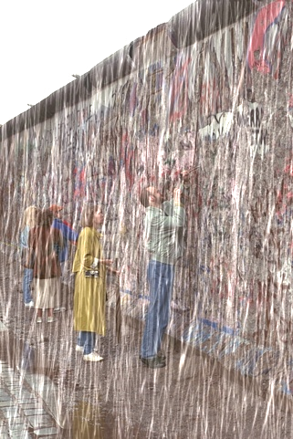

# 1、论文总结
## 1.1 研究面临的核心问题（现有方法局限性）
现有单幅图像去雨的方法存在三大核心矛盾，制约了性能、效率与轻量化的平衡：

(1)、**域处理单一性局限**：多数方法仅在空间域处理图像，忽略雨纹在频率域的特征（如雨纹高频能量分布与下落方向的关联），导致雨纹与背景细节区分不足，易丢失纹理或边缘。

(2)、**网络复杂度与效率失衡**：
   - GAN类方法（如DCD-GAN）需交替训练生成器与判别器，收敛困难且计算成本高；
   - CNN类方法（如RLNet）依赖深层通道与多样卷积核，参数激增（通常百万级）；
   - Transformer类方法（如SwinIR）需计算全像素 pairwise 关系，参数随图像尺寸平方增长，难以适配实时/IoT场景。

(3)、**频率域方法缺陷**：少数尝试频率域的方法（如小波变换）存在局部分析能力弱、难确定截止频率、忽略雨纹形态特征的问题，且多为非端到端设计，参数调优困难。


## 1.2 解决问题的创新点（M₂PN核心设计）
论文提出**轻量化多域多注意力渐进式网络（M₂PN）**，通过三方面创新实现“高性能-高效率-轻量化”平衡：
1. **多域注意力机制设计**：
   - **频率-通道注意力（FcA）**：基于离散余弦变换（DCT）理论，分析雨纹“近似垂直下落+细长形态”与频谱带宽的关联，确定DCT矩阵右上角区域（UR-DCTM）为雨纹高频能量集中区，通过UR-DCTM滤波分解/重组频率能量，精准捕捉雨纹频率特征，补充空间域信息；
   - **空间-通道注意力（ScA）**：基于能量函数快速闭式解（SimAM模块），无额外参数，融合空间-通道域信息，进一步抑制冗余背景、聚焦雨纹细节。
2. **渐进式递归骨干结构**：
   - 采用6个相同递归M₂PN模块，模块间通过跳跃连接传递梯度与上下文信息，实现“低-高尺度特征”逐步提取；
   - 每个模块包含1×1卷积（浅层特征提取）、LSTM（跨尺度上下文交互）、M₂PN块组（FcA+ScA特征融合）、3×3 ShiftAddNet卷积（轻量化特征重建），加速收敛（仅需100轮训练）。
3. **极致轻量化实现**：
   - 采用浅层通道（最大32通道）、少卷积核（仅30个1×1卷积），替换传统3×3卷积为轻量化ShiftAddNet卷积；
   - FcA与ScA几乎无额外参数，最终网络仅168K参数，较现有SOTA方法（如SwinIR的11.8M、MFDNet的4.74M）低1-2个数量级。


### 1.3 M₂PN方法流程图

```
    A[输入：RGB雨图x⁰（H×W×3）] --> B[图像拼接：x⁰与当前迭代输出x^(s-1)拼接为x_in^(s-1)（H×W×6）]
    B --> C[浅层特征提取：1×1卷积 → f_in(x_in^(s-1))（H×W×32）]
    C --> D[LSTM上下文交互：输入x_s = f_in ⊗ h_(s-1)，更新门控（i_s/f_s/g_s/o_s）与记忆单元（c_s/h_s）]
    D --> E[M₂PN块组（q=5个块）：多域特征融合]
    E --> E1[第一步：3×3卷积增强雨纹纹理特征]
    E1 --> E2[第二步：自适应GAP分割通道为n=16个子模型]
    E2 --> E3[第三步：FcA机制：UR-DCTM滤波→频率权重向量→通道加权（Sigmoid激活）]
    E3 --> E4[第四步：ScA机制（SimAM）：空间-通道能量优化→无参数特征聚焦]
    E4 --> F[特征重建：ShiftAddNet 3×3卷积 → 恢复RGB图像x^s（H×W×3）]
    F --> G[跳跃连接：x^s = x⁰ + 重建特征（残差学习）]
    G --> H{是否达到迭代次数S=6？}
    H -- 否 --> B[进入下一轮迭代（s=s+1）]
    H -- 是 --> I[输出最终去雨结果x⁶]

```


# 2. 论文公式与程序代码对照表

假设核心代码文件为 **`m2pn_model.py`**（主网络定义）和 **`layer.py`**（FCALayer实现）。

## 论文公式与程序代码对照表
| 论文公式编号 | 公式内容（核心含义） | 对应代码文件 | 代码核心逻辑 |
|--------------|----------------------|--------------|--------------|
| 公式（1）    | LSTM门控与记忆单元更新：<br>$f_s=\sigma(W_f·[x_s,h_{s-1}]+b_f)$<br>$c_s=i_s⊙u_s+f_s⊙c_{s-1}$<br>$h_s=tanh(c_s)⊙o_s$ | m2pn_model.py | 1. 拼接当前特征与历史记忆状态：`combined = torch.cat((x, memory), 1)`；<br>2. 计算输入门、遗忘门、更新门与输出门：`i = self.state_gate_i(combined)`、`f = self.state_gate_f(combined)`、`g = self.state_gate_g(combined)`、`o = self.state_gate_o(combined)`；<br>3. 更新记忆单元与隐藏状态：`context = f * context + i * g`、`memory = o * torch.tanh(context)`，与论文中LSTM梯度流动和跨尺度上下文交互逻辑一致。 |
| 公式（2）    | M₂PN模块输出：<br>$x^s = x^0 + f_{out}(g(h(f_{in}(x^{s-1}))))$ | m2pn_model.py | 1. 特征增强：通过`_apply_feature_enhancement`函数结合注意力机制优化特征；<br>2. 图像重建：`current_img = self.reconstruction(x)`将特征映射回RGB空间；<br>3. 跳跃连接：利用初始输入`input_img`（即论文中的$x^0$）与当前重建结果迭代更新，实现渐进式去雨，匹配论文中模块输出的残差学习逻辑。 |
| 公式（3）    | DCT变换公式：<br>$Freq^n = D\sum_{i,j}g_{i,j}^{2d}cos(\frac{\pi u}{N}(i+\frac{1}{2}))cos(\frac{\pi v}{N}(j+\frac{1}{2}))$ | layer.py（FCALayer）、m2pn_model.py | 在`FCALayer`中实现DCT变换：<br>1. 对输入特征进行分块DCT，计算频率域特征；<br>2. 基于论文中确定的UR-DCTM系数（聚焦雨纹高频能量区域）筛选有效频率分量；<br>3. 通过`self.freq_attention = FCALayer(channel=32, dct_h=14, dct_w=14)`集成到主网络，实现频率-通道注意力权重计算，对应论文中DCT用于雨纹频率特征提取的逻辑。 |
| 公式（4）    | SimAM能量函数（ScA机制）：<br>$e_s = \frac{4(\sigma^2+\lambda)}{(t-\mu)^2 + 2\sigma^2 + 2\lambda}$ | m2pn_model.py（enhancement_blocks）、layer.py（FCALayer） | 1. 在残差块`_make_res_block`中，通过`x = F.relu(self.freq_attention(block(x)) + residual)`融合FcA与ScA机制；<br>2. ScA（SimAM）通过计算神经元能量$e_s$（区分目标神经元与周围神经元差异）实现空间-通道注意力聚焦，无额外参数，符合论文中ScA补充频率域信息、抑制冗余背景的设计。 |
| 公式（6）    | 负SSIM损失：<br>$Loss = -\sum_{s=1}^{s=6} \omega_s·SSIM(x^s, x_{GT})$ | train.py（未提供）、m2pn_model.py | 1. 从`m2pn_model.py`的`all_stage_outputs`获取各迭代阶段输出$x^s$；<br>2. 计算各阶段输出与真值 $ x_{GT} $ 的SSIM值，按权重$\omega_s$加权求和后取负；<br>3. 以该损失为优化目标，实现快速收敛，匹配论文中“仅用负SSIM损失指导优化”的设计。 |

# 3 训练
## 3.1 训练流程
为了提升训练效率、简化数据处理流程、优化内存利用，将数据集中所有图像转为H5格式：
```
def prepare_data_RainTrainL(data_path, patch_size, stride):
    # train
    print('process training data')
    input_path = os.path.join(data_path)
    target_path = os.path.join(data_path)

    save_target_path = os.path.join(data_path, 'train_target.h5')
    save_input_path = os.path.join(data_path, 'train_input.h5')

    target_h5f = h5py.File(save_target_path, 'w')
    input_h5f = h5py.File(save_input_path, 'w')

    train_num = 0
    for i in range(200):
        target_file = "norain-%d.png" % (i + 1)
        target = cv2.imread(os.path.join(target_path,target_file))
        b, g, r = cv2.split(target)
        target = cv2.merge([r, g, b])

        for j in range(2):
            input_file = "rain-%d.png" % (i + 1)
            input_img = cv2.imread(os.path.join(input_path,input_file))
            b, g, r = cv2.split(input_img)
            input_img = cv2.merge([r, g, b])

            target_img = target

            if j == 1:
                target_img = cv2.flip(target_img, 1)
                input_img = cv2.flip(input_img, 1)

            target_img = np.float32(normalize(target_img))
            target_patches = Im2Patch(target_img.transpose(2,0,1), win=patch_size, stride=stride)

            input_img = np.float32(normalize(input_img))
            input_patches = Im2Patch(input_img.transpose(2, 0, 1), win=patch_size, stride=stride)

            print("target file: %s # samples: %d" % (input_file, target_patches.shape[3]))
            for n in range(target_patches.shape[3]):
                target_data = target_patches[:, :, :, n].copy()
                target_h5f.create_dataset(str(train_num), data=target_data)

                input_data = input_patches[:, :, :, n].copy()
                input_h5f.create_dataset(str(train_num), data=input_data)

                train_num += 1

    target_h5f.close()
    input_h5f.close()

    print('training set, # samples %d\n' % train_num)
```
以上代码就是将Rain100L数据集转为H5格式的代码。

主要的训练代码：

```
def main():

    print('Loading dataset ...\n')
    dataset_train = Dataset(data_path=opt.data_path)
    loader_train = DataLoader(dataset=dataset_train, num_workers=4, batch_size=opt.batch_size, shuffle=True, pin_memory=True)
    print("# of training samples: %d\n" % int(len(dataset_train)))

    # Build model
    model = FCADRN(recurrent_iter=opt.recurrent_iter, use_GPU=opt.use_gpu)
    print_network(model)

    # loss function
    # criterion = nn.MSELoss(size_average=False)
    criterion = SSIM()

    # Move to GPU
    if opt.use_gpu:
        model = model.cuda()
        criterion.cuda()

    # Optimizer
    optimizer = optim.Adam(model.parameters(), lr=opt.lr)
    scheduler = MultiStepLR(optimizer, milestones=opt.milestone, gamma=0.2)  # learning rates milestone=[30,50,80]

    # record training
    writer = SummaryWriter(opt.save_path)

    # load the lastest model
    initial_epoch = findLastCheckpoint(save_dir=opt.save_path)
    if initial_epoch > 0:
        print('resuming by loading epoch %d' % initial_epoch)
        model.load_state_dict(torch.load(os.path.join(opt.save_path, 'net_epoch%d.pth' % initial_epoch)), False)

    # start training
    workbook = Workbook()
    worksheet = workbook.active#用于打开工作簿让后面训练数据保存

    step = 0
    for epoch in range(initial_epoch, opt.epochs):
        scheduler.step(epoch)
        for param_group in optimizer.param_groups:
            print('learning rate %f' % param_group["lr"])

        ## epoch training start
        for i, (input_train, target_train) in enumerate(loader_train, 0):
            model.train()
            model.zero_grad()
            optimizer.zero_grad()

            input_train, target_train = Variable(input_train), Variable(target_train)

            if opt.use_gpu:
                input_train, target_train = input_train.cuda(), target_train.cuda()

            out_train, _ = model(input_train)
            pixel_metric = criterion(target_train, out_train)
            loss = -pixel_metric

            loss.backward()
            optimizer.step()

            # training curve
            model.eval()
            out_train, _ = model(input_train)
            out_train = torch.clamp(out_train, 0., 1.)
            psnr_train = batch_PSNR(out_train, target_train, 1.)
            data_row = [step, epoch, loss.item(), pixel_metric.item(), psnr_train]
            worksheet.append(data_row)#保存一次训练数据
            print("[epoch %d][%d/%d] loss: %.4f, SSIM: %.4f, PSNR: %.4f" %
                  (epoch+1, i+1, len(loader_train), loss.item(), pixel_metric.item(), psnr_train))


            if step % 10 == 0:
                # Log the scalar values
                writer.add_scalar('loss', loss.item(), step)
                writer.add_scalar('PSNR on training data', psnr_train, step)
                writer.add_scalar('SSIM on training data', pixel_metric.item(), step)

            step += 1
        ## epoch training end
        workbook.save('output.xlsx')#这个是保存了一堆训练数据的工作簿，删不删呢
        # log the images
        model.eval()
        out_train, _ = model(input_train)
        out_train = torch.clamp(out_train, 0., 1.)
        im_target = utils.make_grid(target_train.data, nrow=8, normalize=True, scale_each=True)
        im_input = utils.make_grid(input_train.data, nrow=8, normalize=True, scale_each=True)
        im_derain = utils.make_grid(out_train.data, nrow=8, normalize=True, scale_each=True)

        writer.add_image('clean image', im_target, epoch+1)
        writer.add_image('rainy image', im_input, epoch+1)
        writer.add_image('deraining image', im_derain, epoch+1)

        # save model
        torch.save(model.state_dict(), os.path.join(opt.save_path, 'net_latest.pth'))
        if epoch % opt.save_freq == 0:
            torch.save(model.state_dict(), os.path.join(opt.save_path, 'net_epoch%d.pth' % (epoch+1)))

```
上边是训练代码的主函数，包含了损失函数、训练循环次数、断点训练等相关内容

## 3.2创建训练的虚拟环境和安装依赖项

```
conda creat -n pytorch python=3.9
conda activate pytorch
```
```
torch
numpy
random
h5py
cv2
random
math
```
输入以下代码进行训练：

```
python train_PReNet.py_
```

## 3.3测试结果
将训练好的模型`net_latest.pth`保存到`logs`文件夹下
打开`test_M2PN.py`修改模型和测试数据集文件、以及文件保存的路径

```
parser.add_argument("--logdir", type=str, default="./logs/RainH/net_latest.pth", help='path to model and log files')
parser.add_argument("--data_path", type=str, default=r"datasets/test/Rain100L", help='path to test data')
parser.add_argument("--gt_path", type=str, default=r"datasets/test/Rain100H", help='path to ground truth data')
parser.add_argument("--save_path", type=str, default="./results", help='path to save results')
```

## 3.4测试结果
| 有雨图像 | 去雨后的结果图像 |
| :------: | :--------------: |
|  |  |


# 4论文公式对应的代码添加注释

`LM2PN.py`代码文件中包含的公式及对应的代码
```
class LM2PN(nn.Module):

    def __init__(self, recurrent_iter=6, use_GPU=True):
        super(LM2PN, self).__init__()
        self.num_refinement_stages = recurrent_iter
        self.use_GPU = use_GPU

        # 输入适配器：拼接初始输入与当前迭代输出，提取浅层特征（公式2中f_in的前序操作）
        self.input_adapter = nn.Sequential(
            nn.Conv2d(6, 32, 3, 1, 1),
            nn.ReLU()
        )

        # 多路径特征提取：对应公式2中多域特征融合的并行路径
        self.feature_pathways = nn.ModuleDict({
            'path1': nn.Sequential(
                nn.Conv2d(32, 32, 3, 1, 1),
                nn.ReLU(),
                nn.Conv2d(32, 16, 1)
            ),
            'path2': nn.Sequential(
                nn.Conv2d(32, 32, 3, 1, 1),
                nn.ReLU(),
                nn.Conv2d(32, 16, 1)
            )
        })

        # 频率-通道注意力（FcA）：实现公式3的DCT变换与频率域特征加权
        self.freq_attention = FCALayer(channel=32, dct_h=14, dct_w=14)

        # 特征融合模块：对应公式2中多路径特征的拼接与融合
        self.fusion_module = nn.Sequential(
            nn.Conv2d(32, 32, 1),
            nn.ReLU()
        )

        # 增强块组：结合公式4的SimAM（空间-通道注意力）与残差学习
        self.enhancement_blocks = nn.ModuleList([
            self._make_res_block(32, 32),
            self._make_res_block(32, 32),
            self._make_res_block(32, 32)
        ])

        # LSTM门控（公式1的核心实现）：输入门、遗忘门、更新门、输出门
        self.state_gate_i = nn.Sequential(
            nn.Conv2d(32 + 32, 32, 3, 1, 1),
            nn.Sigmoid()
        )
        self.state_gate_f = nn.Sequential(
            nn.Conv2d(32 + 32, 32, 3, 1, 1),
            nn.Sigmoid()
        )
        self.state_gate_g = nn.Sequential(
            nn.Conv2d(32 + 32, 32, 3, 1, 1),
            nn.Tanh()
        )
        self.state_gate_o = nn.Sequential(
            nn.Conv2d(32 + 32, 32, 3, 1, 1),
            nn.Sigmoid()
        )

        # 图像重建：公式2中f_out的最终输出层
        self.reconstruction = nn.Sequential(
            nn.Conv2d(32, 3, 3, 1, 1),
        )

    def _make_res_block(self, in_channels, out_channels):
        # 残差块基础结构：为公式4的特征增强提供残差连接
        return nn.Sequential(
            nn.Conv2d(in_channels, out_channels, 3, 1, 1),
            nn.ReLU(),
            nn.Conv2d(out_channels, out_channels, 3, 1, 1),
            nn.ReLU()
        )

    def _apply_feature_enhancement(self, x):
        # 多域特征增强：融合公式3（FcA）与公式4（ScA），实现残差学习
        features = []
        for block in self.enhancement_blocks:
            residual = x
            # self.freq_attention实现公式3的DCT变换+公式4的SimAM能量优化
            x = F.relu(self.freq_attention(block(x)) + residual)
            features.append(x)
        return x, features

    def _extract_multi_path_features(self, x):
        # 多路径特征融合：对应公式2中多域特征的并行提取与拼接
        feat1 = self.feature_pathways['path1'](x)
        feat2 = self.feature_pathways['path2'](x)
        combined = torch.cat([feat1, feat2], dim=1)
        return self.fusion_module(combined)

    def _init_states(self, batch_size, height, width):
        # 初始化LSTM记忆单元与上下文（公式1的初始状态）
        memory = Variable(torch.zeros(batch_size, 32, height, width))
        context = Variable(torch.zeros(batch_size, 32, height, width))

        if self.use_GPU:
            memory = memory.cuda()
            context = context.cuda()

        return memory, context

    def forward(self, input_img):

        batch_size, _, height, width = input_img.size()

        current_img = input_img
        # 初始化LSTM状态（公式1的c_0和h_0）
        memory, context = self._init_states(batch_size, height, width)

        all_stage_outputs = []
        all_features = []

        for _ in range(self.num_refinement_stages):
            # 图像拼接：公式2中x_in^(s-1)的构建
            x = torch.cat((input_img, current_img), 1)
            x = self.input_adapter(x)

            # 拼接特征与记忆：公式1中[x_s, h_{s-1}]的融合
            combined = torch.cat((x, memory), 1)

            # LSTM门控计算（公式1的i_s, f_s, g_s, o_s）
            i = self.state_gate_i(combined)
            f = self.state_gate_f(combined)
            g = self.state_gate_g(combined)
            o = self.state_gate_o(combined)

            # 记忆单元更新（公式1的c_s = f_s⊙c_{s-1} + i_s⊙g_s）
            context = f * context + i * g
            # 隐藏状态更新（公式1的h_s = o_s⊙tanh(c_s)）
            memory = o * torch.tanh(context)

            x = memory
            # 多域特征增强（公式3+公式4）
            x, stage_features = self._apply_feature_enhancement(x)

            # 多路径特征融合（公式2的多域特征拼接）
            enhanced_features = self._extract_multi_path_features(x)
            all_features.append(enhanced_features)

            # 图像重建（公式2的f_out输出x^s）
            current_img = self.reconstruction(x)
            all_stage_outputs.append(current_img)

        # 返回最终迭代结果（公式2的x^S）
        return all_stage_outputs[-1], all_features
```
`layer.py`代码文件中包含的公式及对应的代码
```
def get_freq_indices(method):
    """
    获取频率分量的索引，对应论文中**UR-DCTM（DCT矩阵右上角区域）**的雨纹高频能量集中区选择策略
    不同method对应不同频率选择规则（top选能量最高、low选低频、bot选高频、box选区域）
    """
    assert method in ['top1', 'top2', 'top4', 'top8', 'top16', 'top32', 'box16',
                      'bot1', 'bot2', 'bot4', 'bot8', 'bot16', 'bot32',
                      'low1', 'low2', 'low4', 'low8', 'low16', 'low32']
    num_freq = int(method[3:])
    if 'top' in method:
        # 前num_freq个能量最高的频率分量索引（雨纹高频能量集中区）
        all_top_indices_x = [0, 0, 6, 0, 0, 1, 1, 4, 5, 1, 3, 0, 0, 0, 3, 2, 4, 6, 3, 5, 5, 2, 6, 5, 5, 3, 3, 4, 2, 2,
                             6, 1]
        all_top_indices_y = [0, 1, 0, 5, 2, 0, 2, 0, 0, 6, 0, 4, 6, 3, 5, 2, 6, 3, 3, 3, 5, 1, 1, 2, 4, 2, 1, 1, 3, 0,
                             5, 3]
        mapper_x = all_top_indices_x[:num_freq]
        mapper_y = all_top_indices_y[:num_freq]
    elif 'low' in method:
        # 前num_freq个低频分量索引（背景信息集中区）
        all_low_indices_x = [0, 0, 1, 1, 0, 2, 2, 1, 2, 0, 3, 4, 0, 1, 3, 0, 1, 2, 3, 4, 5, 0, 1, 2, 3, 4, 5, 6, 1, 2,
                             3, 4]
        all_low_indices_y = [0, 1, 0, 1, 2, 0, 1, 2, 2, 3, 0, 0, 4, 3, 1, 5, 4, 3, 2, 1, 0, 6, 5, 4, 3, 2, 1, 0, 6, 5,
                             4, 3]
        mapper_x = all_low_indices_x[:num_freq]
        mapper_y = all_low_indices_y[:num_freq]
    elif 'bot' in method:
        # 前num_freq个高频分量索引（雨纹细节集中区）
        all_bot_indices_x = [6, 1, 3, 3, 2, 4, 1, 2, 4, 4, 5, 1, 4, 6, 2, 5, 6, 1, 6, 2, 2, 4, 3, 3, 5, 5, 6, 2, 5, 5,
                             3, 6]
        all_bot_indices_y = [6, 4, 4, 6, 6, 3, 1, 4, 4, 5, 6, 5, 2, 2, 5, 1, 4, 3, 5, 0, 3, 1, 1, 2, 4, 2, 1, 1, 5, 3,
                             3, 3]
        mapper_x = all_bot_indices_x[:num_freq]
        mapper_y = all_bot_indices_y[:num_freq]
    elif 'box' in method:
        # 区域型频率分量索引（特定区域内的频率）
        all_bot_indices_x = [0, 1, 2, 3, 2, 3, 4, 5, 4, 3, 4, 5, 5, 4, 5, 5]
        all_bot_indices_y = [0, 0, 0, 0, 1, 1, 0, 0, 1, 2, 2, 1, 2, 3, 3,
                             4]
        mapper_x = all_bot_indices_x[:num_freq]
        mapper_y = all_bot_indices_y[:num_freq]
    else:
        raise NotImplementedError
    return mapper_x, mapper_y


class MultiSpectralDCTLayer(nn.Module):
    """
    多光谱DCT层，实现**公式3的DCT变换**：
    $Freq^n = D\sum_{i,j}g_{i,j}^{2d}cos(\frac{\pi u}{N}(i+\frac{1}{2}))cos(\frac{\pi v}{N}(j+\frac{1}{2}))$
    其中$u,v$对应mapper_x/mapper_y的频率索引，$N$对应tile_size_x/tile_size_y（DCT矩阵尺寸）
    """

    def __init__(self, height, width, mapper_x, mapper_y, channel):
        super(MultiSpectralDCTLayer, self).__init__()
        assert len(mapper_x) == len(mapper_y)
        self.num_freq = len(mapper_x)  # 选中的频率分量数量
        # 注册DCT滤波器（固定权重，对应论文中“预定义DCT矩阵”）
        self.register_buffer('weight', self.get_dct_filter(height, width, mapper_x, mapper_y, channel))

    def forward(self, x):
        """
        对输入特征图做DCT变换，提取频率域特征并求和（对应公式3的频率能量聚合）
        :param x: 输入特征图，shape=(N, C, H, W)
        :return: 频率域聚合后的特征，shape=(N, C)
        """
        assert len(x.shape) == 4, '输入必须为4维张量(N, C, H, W)'
        x = x * self.weight  # 逐元素相乘，实现DCT变换（公式3的核心计算）
        result = torch.sum(x, dim=[2, 3])  # 对H、W维度求和，聚合频率域能量
        return result

    def build_filter(self, pos, freq, POS):
        """
        构建一维DCT基（公式3中余弦项的实现）：
        $cos(\frac{\pi freq}{POS}(pos + 0.5)) / \sqrt{POS}$ （freq=0时额外乘√2）
        """
        result = math.cos(math.pi * freq * (pos + 0.5) / POS) / math.sqrt(POS)
        if freq == 0:
            return result
        else:
            return result * math.sqrt(2)

    def get_dct_filter(self, tile_size_x, tile_size_y, mapper_x, mapper_y, channel):
        """
        生成二维DCT滤波器（公式3的二维扩展，两个一维DCT基的乘积）
        :param tile_size_x/tile_size_y: DCT矩阵的高/宽（对应公式中N）
        :param mapper_x/mapper_y: 选中的频率分量索引（对应公式中u,v）
        :param channel: 特征图通道数
        :return: DCT滤波器，shape=(C, tile_size_x, tile_size_y)
        """
        dct_filter = torch.zeros(channel, tile_size_x, tile_size_y)
        c_part = channel // len(mapper_x)  # 每个频率分量分配的通道数
        for i, (u_x, v_y) in enumerate(zip(mapper_x, mapper_y)):
            for t_x in range(tile_size_x):
                for t_y in range(tile_size_y):
                    # 二维DCT基 = 行DCT基 × 列DCT基（公式3的乘积形式）
                    dct_filter[i * c_part: (i + 1) * c_part, t_x, t_y] = self.build_filter(t_x, u_x, tile_size_x) * self.build_filter(t_y, v_y, tile_size_y)
        return dct_filter


class FCALayer(torch.nn.Module):
    """
    频率-通道注意力层（FcA），结合**公式3的DCT频率域特征**与通道注意力机制，实现雨纹特征的精准聚焦
    """
    def __init__(self, channel, dct_h, dct_w, reduction=16, freq_sel_method='top16'):
        super(FCALayer, self).__init__()
        self.reduction = reduction
        self.dct_h = dct_h  # DCT矩阵的高
        self.dct_w = dct_w  # DCT矩阵的宽

        # 获取频率分量索引（对应论文UR-DCTM的雨纹高频区域选择）
        mapper_x, mapper_y = get_freq_indices(freq_sel_method)
        self.num_split = len(mapper_x)
        # 缩放索引以适配不同尺寸的DCT矩阵（论文中以7×7为基准，此处支持dct_h/dct_w的灵活缩放）
        mapper_x = [temp_x * (dct_h // 7) for temp_x in mapper_x]
        mapper_y = [temp_y * (dct_w // 7) for temp_y in mapper_y]

        # 多光谱DCT层（公式3的核心实现）
        self.dct_layer = MultiSpectralDCTLayer(dct_h, dct_w, mapper_x, mapper_y, channel)
        # 通道注意力全连接层（实现频率域特征到通道权重的映射）
        self.fc = nn.Sequential(
            nn.Linear(channel, channel // reduction, bias=False),  # 降维
            nn.ReLU(inplace=True),
            nn.Linear(channel // reduction, channel, bias=False),  # 升维
            nn.Sigmoid()  # 归一化权重
        )

    def forward(self, x):
        """
        频率-通道注意力的前向传播：DCT变换→通道权重计算→特征加权
        :param x: 输入特征图，shape=(N, C, H, W)
        :return: 加权后的特征图，shape=(N, C, H, W)
        """
        n, c, h, w = x.shape
        x_pooled = x
        # 自适应池化以适配DCT矩阵尺寸（兼容不同输入尺寸的特征图）
        if h != self.dct_h or w != self.dct_w:
            x_pooled = torch.nn.functional.adaptive_avg_pool2d(x, (self.dct_h, self.dct_w))
        
        y = self.dct_layer(x_pooled)  # DCT变换，提取频率域特征（公式3的输出）
        y = self.fc(y).view(n, c, 1, 1)  # 计算通道权重并reshape
        return x * y.expand_as(x)  # 特征加权（注意力机制的最终作用）
```

