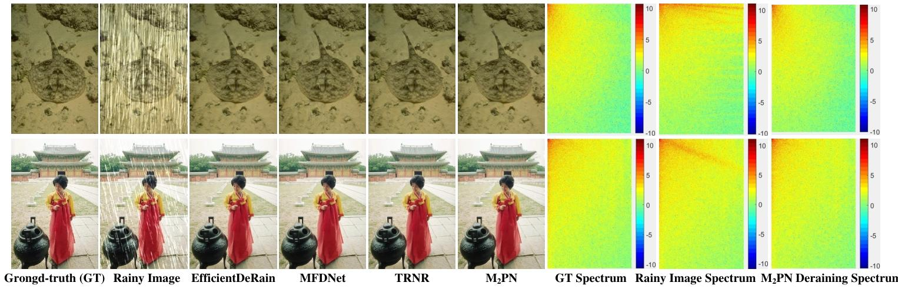

请查看详细内容：[docs/report.md](docs/report.md)
# M2PN:基于一种轻量级多域多注意力渐进式网络的单图去雨模型
[Junliu Zhong](), [Zhiyi Li](), [Dan Xiang](), [Maotang Han]() ,[Changsheng Li](), [Yanfen Gan]()

This repository is the official PyTorch implementation of M2PN: Image Restoration Using Shifted Window Transformer
([ACM MM](https://dl.acm.org/doi/10.1145/3664647.3681575),  [pretrained models](https://github.com/Arican-Lee/M2PN/tree/main/logs), [visual results](https://github.com/Arican-Lee/M2PN/tree/main/figs/results)). M2PN achieves **state-of-the-art performance** in
- Lightweight Multi-domain Multi-attention Progressive Network for Single Image Deraining

> Currently, the information processing in a spatial domain alone has intrinsic limitations that hinder the deep network's effectiveness (performance) improvement in a single image deraining. Moreover, the deraining networks' structures and learning processes are becoming increasingly intricate, leading to challenges in structural lightweight, and training and testing efficiency. We propose a lightweight multi-domain multi-attention progressive network (M2PN) to handle these challenges. For performance improvement, the M2PN backbone applies a simple progressive CNN-based structure consisting of the S same recursive M2PN modules. This recursive backbone with a skip connection mechanism allows for better gradient flow and helps to effectively capture low-to-high-level/scales spatial features in progressive structure to improve contextual information acquisition. To further complement acquired spatial information for better deraining, we conduct spectral analysis on the frequency energy distribution of rain steaks, and theoretically present the relationship between the spectral bandwidths and the unique falling characteristics and special morphology of rain steaks. We present the frequency-channel attention (FcA) mechanism and the spatial-channel attention (ScA) mechanism to fuse frequency-channel features and spatial features better to distinguish and remove rain steaks. The simple recursive network structure and effective multi-domain multi-attention mechanism serve as the M2PN to achieve superior performance and facilitate fast convergence during training. Furthermore, the M2PN structure, with a small network component quantity, shallow network channels, and few convolutional kernels, requires only 168K parameters, which is 1 to 2 orders of magnitude lower than the existing SOTA networks. The experimental results demonstrate that even with such a few network parameters, M2PN still achieves the best overall performance.
>

  

#### Contents

1. [Training](#Training)
1. [Testing](#Testing)
1. [Results](#Results)

### Training

Used training and testing sets can be downloaded as follows:

| Lightweight Multi-domain Multi-attention Progressive Network for Single Image Deraining | 1 | 2 | 3 | 4 | 5 |
| :--- | :---: | :---: | :---: | :---: | :---: |
| Training Set | Rain100L | Rain100H | Rain200L | Rain200H | Rain12600 |
| Testing Set | Rain100L | Rain100H | Rain200L | Rain200H | Rain1400 |

The testing code is at [KAIR](https://github.com/Arican-Lee/M2PN/blob/main/test_M2PN.py).

## Testing (without preparing datasets)
For your convience, we provide preparing datasets in `/logs`. 
If you just want codes, downloading `/LM2PN.py`, `util.py` is enough. 

## Results
We achieved state-of-the-art performance for Single Image Deraining. Detailed results can be found in the [paper](https://dl.acm.org/doi/10.1145/3664647.3681575). 

Classical Image Super-Resolution (click me)

  

  
